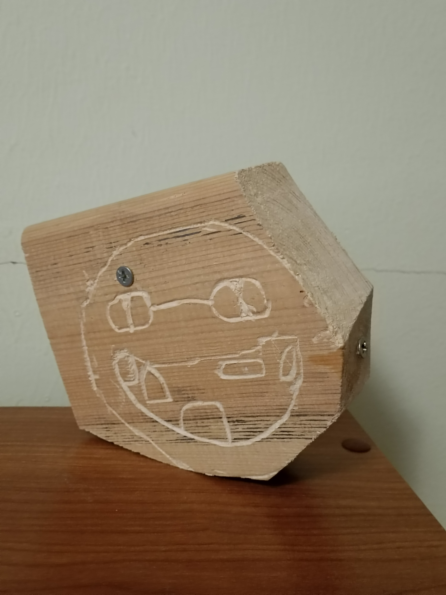

# totem
Памятник человеческой лени
## Используемые материалы и инструменты
Материалы: 
брус
Инструменты:
1. защитные очки и наушники;
2. ножовка или дремель или мини-болгарка;
3. лобзик или реноватор;
4. саморезы;
5. шуруповерт;
6. кривые руки.
## Идея
В начале пути были наполеоновские планы сделать [это](https://github.com/OSoba-Mask/Buldiga-meme-badge) но в объёме. В какой-то момент было решено отказаться от такой затеи, таким образом, получился такой тотем (неспроста такой заголовок:>).
## Результат

Видео с созданием (шакалы поели):
